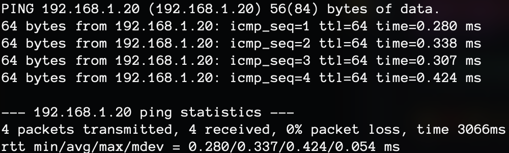
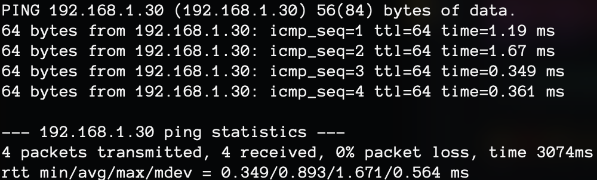
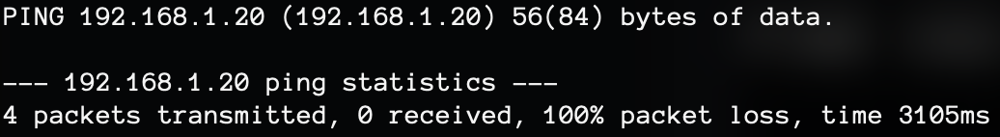
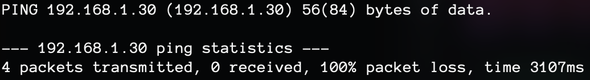

# Déploiement de VM sous Docker avec Firewall et SSH sécurisé

## 1️⃣ Configuration matérielle

### 🖥️ Matériel alloué à chaque conteneur
| Conteneur | RAM   | CPU | Disque |
|-----------|------|-----|--------|
| VM1 (Superviseur) | 512 Mo | 1 vCPU | 5 Go |
| VM2 (Service 1) | 512 Mo | 1 vCPU | 5 Go |
| VM3 (Service 2) | 512 Mo | 1 vCPU | 5 Go |

📌 **Justification** :
- Ces valeurs sont suffisantes pour un environnement de test sous Docker.
- Docker partage les ressources dynamiquement, donc pas besoin de sur-allouer.
- L’objectif est de **minimiser la consommation** tout en garantissant le bon fonctionnement du SSH et du firewall.

---

## 2️⃣ Configuration réseau

Chaque conteneur est dans un réseau **bridge** personnalisé pour permettre **VM1** de communiquer avec **VM2 et VM3**, tout en bloquant la communication entre **VM2 et VM3**.

```yaml
networks:
  vm_network:
    driver: bridge
```

---

## 3️⃣ Implémentation des restrictions réseau

### Autoriser SSH sur le port 2222
```
ufw allow 2222/tcp
```

### Bloquer la communication entre VM2 et VM3
```
ufw deny out to 192.168.1.30
ufw deny in from 192.168.1.30
ufw deny out to 192.168.1.20
ufw deny in from 192.168.1.20
```

## 4️⃣ Vérification et tests

### ✅ VM1 peut communiquer avec VM2 et VM3
```
docker exec -it vm1 ping -c 4 192.168.1.20
docker exec -it vm1 ping -c 4 192.168.1.30
```
|  |  |
|---------------------------------------------|---------------------------------------------|

### ❌ VM2 et VM3 ne peuvent PAS communiquer
```
docker exec -it vm3 ping -c 4 192.168.1.20
docker exec -it vm2 ping -c 4 192.168.1.30
```
|  |  |
|---------------------------------------------|---------------------------------------------|

## 5️⃣ Sécurisation complémentaire

### 🔐 Restreindre SSH à une IP spécifique

Actuellement, SSH est ouvert sur 0.0.0.0. On peut le restreindre à VM1 uniquement en ajoutant dans /etc/ssh/sshd_config :
```
ListenAddress 192.168.1.10  # VM1 uniquement
AllowUsers monuser
```
